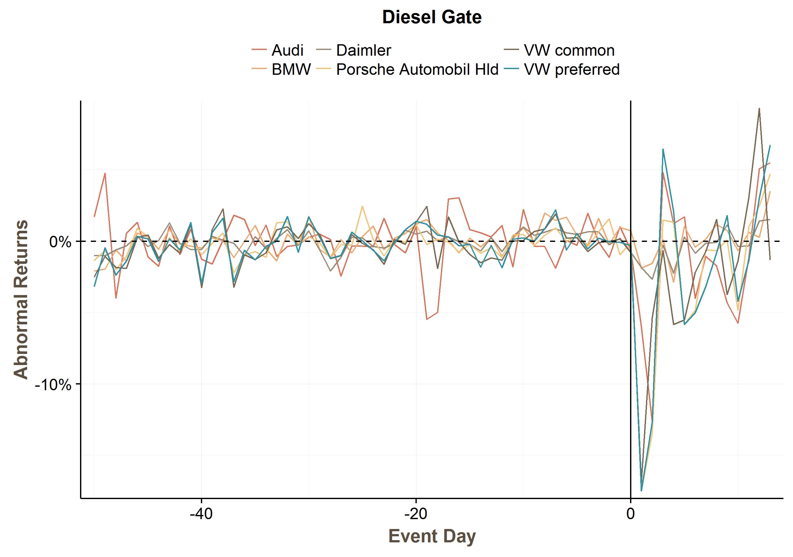

[](https://cran.rstudio.com/web/packages/EventStudy) 
[](https://cran.r-project.org/package=EventStudy)
[](https://cran.r-project.org/web/packages/EventStudy/)

# EventStudyTools (EST) API R Wrapper

[Buy us a Coffee](buymeacoff.ee/wZB75JA1Q)

This software library provides the capability to easily deploy the EST API.

* More detailed documentation about available applications can be found on [http://wwww.eventstudytools.com](http://wwww.eventstudytools.com)
* The full API documentation is presented on our website: [http://wwww.eventstudytools.com/API-ARC](http://wwww.eventstudytools.com/API-ARC)

## Installation

Developer Version
```
library(devtools)
install_github("EventStudyTools/api-wrapper.r")
```

CRAN Version
```
install.packages("EventStudy")
```

## Intraday EventStudy

We are working internally with Intraday data and can provide on request code for such studies. 

## Ask a Question

- [Facebook](https://www.facebook.com/EventStudy/)
- [Commercial](http://muon-stat.com/)
- [Website](http://eventstudytools.com)

## Simple Example of an Abnormal Returns Calculator (ARC) launch

You can find a **free** API key on our website: [https://www.eventstudytools.com/api-key](https://www.eventstudytools.com/api-key)
```
apiUrl <- "http://api.eventstudytools.com"
apiKey <- "Insert API key"

# Generate Example Data
EventStudy::getSP500ExampleFiles()

library(EventStudy)
# Setup API Connection
estSetup <- EventStudyAPI$new(apiUrl)
estSetup$authentication(apiKey)

# Type of Analysis
estType <- "arc"

# CSV files
dataFiles <- c("request_file" = "01_RequestFile.csv", 
               "firm_data"    = "02_FirmData.csv", 
               "market_data"  = "03_MarketData.csv")

# Path of result files
resultPath <- "results"

# Perform standard Event Study
estRes <- estSetup$performDefaultEventStudy(estType   = estType,
                                  dataFiles = dataFiles, 
                                  destDir   = resultPath)
```


## Visit Our App on ShinyApps

[Diesel Gate App](https://muon-stat.shinyapps.io/dieselgate/)



## Details can be found in our vignettes

- [Introduction in EventStudy R Package](https://cran.rstudio.com/web/packages/EventStudy/vignettes/introduction_eventstudy.html)
- [Use Case: Dieselgate](https://cran.rstudio.com/web/packages/EventStudy/vignettes/howto_eventstudy.html)
- [Parameters](https://cran.rstudio.com/web/packages/EventStudy/vignettes/parameters_eventstudy.html)
- [RStudio Addin](https://cran.rstudio.com/web/packages/EventStudy/vignettes/addin_eventstudy.html)
- [FAQ](https://cran.rstudio.com/web/packages/EventStudy/vignettes/FAQ.html)
