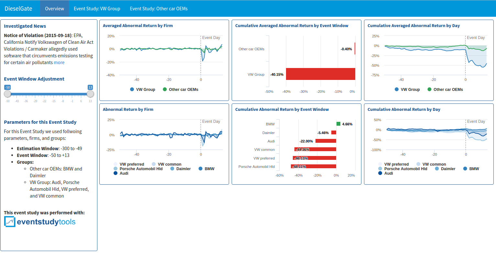

  

# EventStudyTools (EST) API R Wrapper

## Purpose of this Package

-   Prepare data for an Event Study in R.

    -   Some pre-tests on the data are applied such that you do not get some strange errors from the API.

-   Perform an Event Study using the <https://www.eventstudytools.com> API.

-   Parse results to R and do additional analysis and plotting with results.

## Further Information & Help

-   The description of test statistics and available models can be found on [Significance Tests](https://www.eventstudytools.com/significance-tests/) and [Expected Return Models](https://www.eventstudytools.com/expected-return-models/).

-   If another consultancy on event study or panel data analysis is necessary, you may contact me, Dr. Simon Müller (sm@data-zoo.de).

-   Don't hesitate to contact Dr. Simon Müller if you want to perform Event Studies On-Premise, with low latency or large scale.

-   If you like the package: [Buy us a Coffee](https://www.buymeacoffee.com/wZB75JA1Q)

## Installation

Developer Version

    library(devtools)
    install_github("EventStudyTools/api-wrapper.r")

CRAN Version

    install.packages("EventStudy")

## Simple Example of an Abnormal Returns Calculator (ARC) launch

    apiKey <- "Insert API key"

    # Generate Example Data
    EventStudy::getSP500ExampleFiles()

    library(EventStudy)
    # Setup API Connection
    estSetup <- EventStudyAPI$new()
    estSetup$authentication(apiKey)

    # Type of Analysis
    estType <- "arc"

    # CSV files
    dataFiles <- c("request_file" = "01_RequestFile.csv", 
                   "firm_data"    = "02_FirmData.csv", 
                   "market_data"  = "03_MarketData.csv")

    # Path of result files
    resultPath <- "results"

    # Perform standard Event Study
    estSetup$performDefaultEventStudy(estType   = estType,
                                      dataFiles = dataFiles, 
                                      destDir   = resultPath)
                            
    # Parse Results                        
    estParser <- ResultParser$new()
    request_data = estParser$get_request_file("01_RequestFile.csv")
    analysis_report = estParser$get_analysis_report("results/analysis_report.csv")

    ar_result = estParser$get_ar("results/ar_results.csv", analysis_report, request_data)
    ar_result$plot()

    aar_result = estParser$get_aar("results/aar_results.csv", analysis_report)
    aar_result$plot(ci_statistics = "Generalized Sign Z")
    aar_result$plot_cumulative()
    aar_result$plot_test_statistics(p=.99)

    car_result = estParser$get_car("results/car_results.csv", analysis_report)
    car_result$car_tbl

    caar_result = estParser$get_caar("results/caar_results.csv")
    caar_result$caar_tbl
    caar_result$statistics_tbl

## Visit Our App on ShinyApp

[Diesel Gate App](https://muon-stat.shinyapps.io/dieselgate/)

## Details can be found in our vignettes

-   [Get Started](https://cran.r-project.org/package=EventStudy/vignettes/introduction_eventstudy.html)
-   [Use Case: Dieselgate](https://cran.r-project.org/package=EventStudy/vignettes/howto_eventstudy.html)
-   [Parameters](https://cran.r-project.org/package=EventStudy/vignettes/parameters_eventstudy.html)
-   [RStudio Addin](https://cran.r-project.org/package=EventStudy/vignettes/addin_eventstudy.html)
