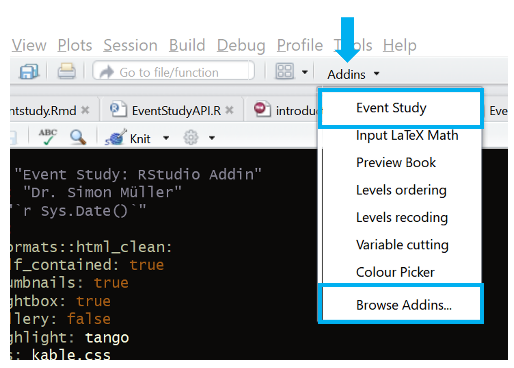
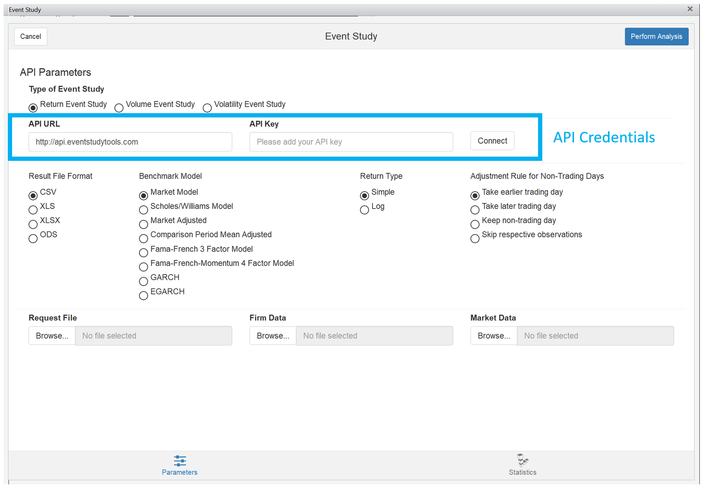

```{r setup, include=FALSE}
knitr::opts_chunk$set(echo = TRUE)
```

# Motivation

We developed an easy to use and intuitive Event Study addin for the popular R IDE from RStudio. The addin is designed in view to our web frontend, but with the advantage that the user can immediately work with the results from R. Furthermore, as there are many test statistics we hope that this addin helps you to perform your Event Study in a faster. 

# How to Use

With the installation of the EventStudy package, our RStudio Addin (if you use RStudio as IDE) is automatically installed. The addin can be easily started by clicking *Event Study* in the Addins menu. If you do not find the addin in the menu, then you may find it in the window that is opened in *Browse Addins...*.



You can work then in the addin as on our web API interface that is self-explanatory. Beside our web API interface it is mandatory to use a EventStudyTools key that can be copied from our [web page](https://www.eventstudytools.com/). 

One remark: by design we used an upload field for the three data files (request, firm, and market data). Internally, we use just the path to the file.




# How to Cite

Please cite our work in your [publication](https://eventstudytools.com/how-cite-eventstudytoolscom).
